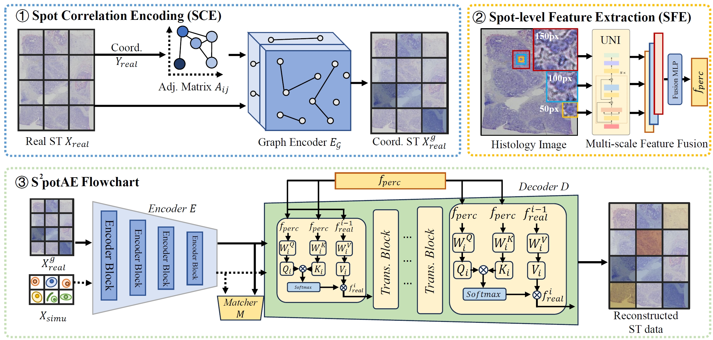

# S^2potAE


## Overview of S^2potAE



## Table of Contents

- [Installation](#installation)
- [Data](#data)
- [Training](#model-training)
- [Acknowledgement](#acknowledgement)


## Installation

```bash
conda create python=3.9 -n spotae
conda activate spotae
pip install -r requirement.txt
```


## Data
All the datasets used in this paper can be downloaded from url：[https://zenodo.org/records/12792074](https://zenodo.org/uploads/15253541)


## Preprocess data

To preprocess the data, run the `data_prepare.py` script located in the `spotd` directory. Use the following command:
```
python spotd/data_prepare.py
```


## Run S^2potAE

To train the S^2potAE model, use the following command:

```
python main.py
```


## Contact details

If you have any questions, please contact tychen.cs@gmail.com


## Acknowledgement
We gratefully acknowledge the authors of [MACD](https://github.com/wenwenmin/MACD). Some implementations in this repository were inspired by and refer to the content of MACD.


